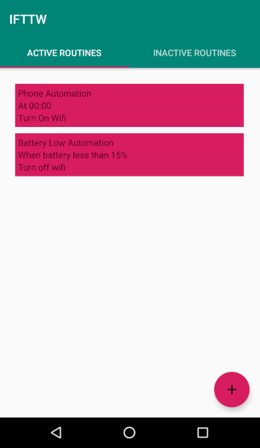
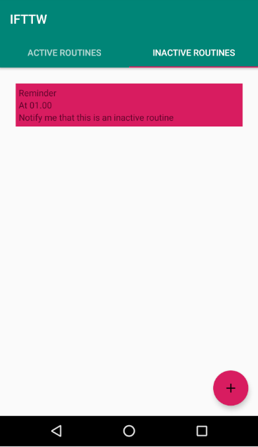
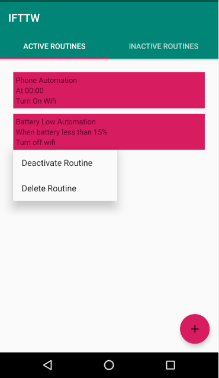
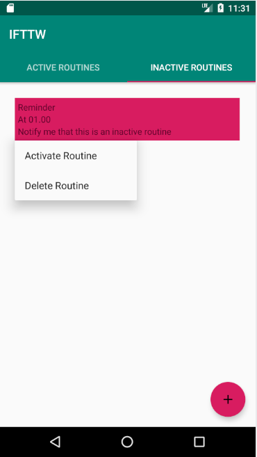
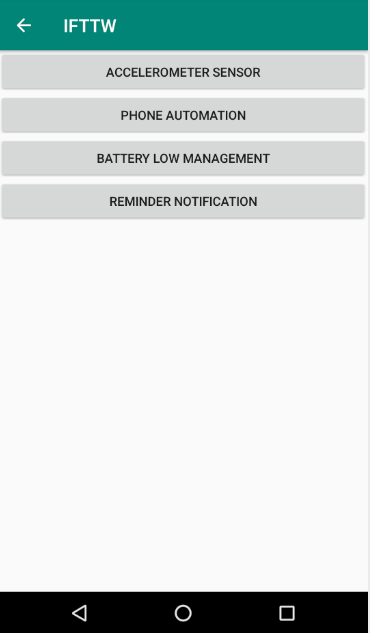
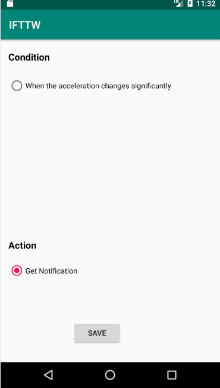
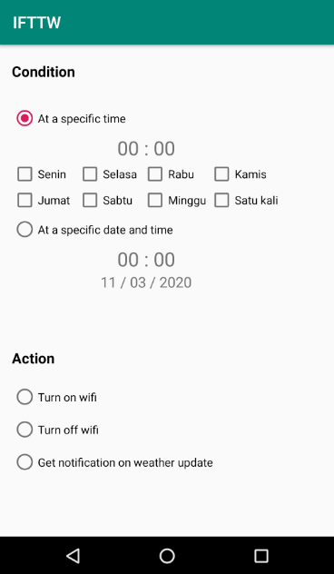
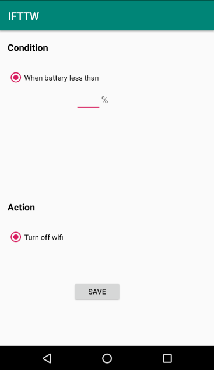
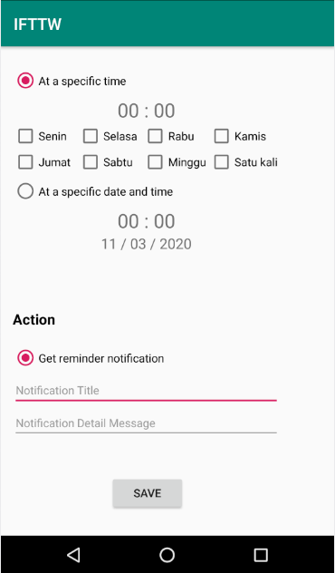

# IF3210-2020-13-IFTTW

## Deskripsi Aplikasi
Aplikasi IFTTW (If This Then What) adalah aplikasi yang memungkinkan pengguna membuat routine-routine yang otomatis akan berjalan bila kondisi tertentu terpenuhi. Terdapat 4 kategori routine yang dapat dibuat pengguna yaitu:
1. Accelerometer Sensor 
Menggunakan sensor accelerometer pada device android untuk mendeteksi percepatan yang signifikan. Bila terdeteksi akan menampilkan notifikasi terdeteksi percepatan yang cukup besar.
2. Phone Automation 
Dalam waktu-waktu spesifik yang didefinisikan pengguna, aplikasi dapat mematikan atau menyalakan Wifi dan mendapatkan notifikasi mengenai cuaca di Bandung.
3. Battery Low Management 
Ketika baterai device android kurang dari sekian persen yang didefinisikan pengguna, maka aplikasi otomatis akan mematikan Wifi.
4. Reminder Notification 
Mengatur notifikasi pengingat yang dapat dikustomisasi pengguna dalam waktu-waktu spesifik yang dapat didefinisikan pengguna pula.

## Cara Kerja Aplikasi (Mengenai Pemenuhan Spesifikasi Aplikasi)
1. Pengguna dapat membuat rutin baru dengan memilih 1 dari 4 kategori rutin. Satu rutin terdiri dari satu kondisi dan satu aksi yang digambarkan dengan radio button sehingga pengguna hanya dapat memilih satu rutin dan satu aksi untuk membentuk rutin.
2. Aplikasi menggunakan Services dan AlarmManager untuk menjalankan rutin yang terdaftar aktif walaupun aplikasi sedang tidak dibuka.
3. Aplikasi dapat menampilkan daftar rutin yang telah dibuat dengan mengambil data rutin dari SQLiteDataBase dan menampilkannya dengan RecyclerView. Rutin aktif maupun tidak aktif ditampilkan dengan TabLayout.
4. Pengguna dapat mengelola rutin yang dimilikinya. Pengguna dapat menonaktifkan , mengaktifkan, atau menghapus rutin dengan menekan lama pada item rutin sehingga muncul popup menu untuk mengapus, mengaktifkan, atau menonaktifkan rutin.
5. Timer yang mengatur rutin pada suatu waktu tertentu (misal, 24 Februari 2020, 15:49), setiap hari pada waktu tertentu (misal, 16:10), atau setiap minggu pada hari dan waktu tertentu (misal, setiap Kamis pada 12:15) terdapat pada kategori rutin ‘Phone Automation’ dan ‘Reminder Notification’
6. Modul kondisi yang menggunakan sensor akselerometer akan memunculkan notifikasi bila percepatan yang dideteksi cukup tinggi.
7. Modul aksi notifikasi teks pada waktu tertentu dengan kustomisasi terhadap title dan message notifikasi terdapat pada kategori rutin ‘Reminder Notification’
8. Modul aksi yang mengakses API eksternal OpenWeather untuk memberitahu cuaca pada waktu yang ditentukan pengguna di Bandung terdapat pada kategori rutin ‘Phone Automation’
9. Modul aksi yang mengaktifkan/mematikan WiFi terdapat pada kategori rutin ‘Phone Automation’

## Library yang Digunakan dan Justifikasi Penggunaannya
Pada Aplikasi IFTTW hanya digunakan library bawaan.

## Screenshot Aplikasi
### Home (Active Routines)

### Home (Inctive Routines)

### Active (Contextual Popup Menu)

### Inactive (Contextual Popup Menu)

### Routine Category (Add Routine)

### Accelerometer Sensor

### Phone Automation

### Battery Low Management

### Reminder Notification
